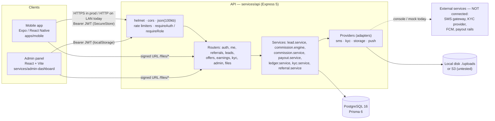

# 04 — Architecture (as built)

## Deployment status

**Local-only. Nothing is deployed.** PostgreSQL, the API, Metro (the mobile bundler) and the Vite admin panel all run on
the developer's Windows PC. The phone reaches the API over the local Wi-Fi at `EXPO_PUBLIC_API_URL`
(`apps/mobile/.env`, currently the PC's LAN IP). There's no domain, TLS, hosting, CI/CD, EAS build, monitoring or
backups. The code is pushed to `github.com/Mokshitsharma/Banksaathi-clone`, branch `main`.

## System diagram

## Component boundaries

| Component | Owns | Talks to | Must not |
|---|---|---|---|
| `apps/mobile` | Affiliate UI, session in SecureStore, push token registration | API only (`src/api/client.ts` axios; base URL from `EXPO_PUBLIC_API_URL`) | Hold secrets; compute money (it only displays server values) |
| `services/admin-dashboard` | Admin UI, session in `localStorage` | API only (`src/api.ts` fetch; base URL from `VITE_API_URL`) | — |
| `services/api` routers | HTTP, zod validation, auth and role checks, rate limits | services, Prisma | — |
| `services/api` services | Business rules and all money movement | Prisma (transactions), providers | Be called from clients directly |
| `services/api/src/providers` | Integrations with outside services, behind interfaces | outside services (today: console, mock or disk) | Contain business rules |
| PostgreSQL | Data, plus integrity guards (ledger trigger, CHECKs, unique constraints) | — | — |
| `packages/shared-types` | TypeScript request/response contracts | imported with `import type` by the mobile app and admin panel | Contain runtime code (bundlers never resolve it) |

**Confirmed by searching `services/api/src` and `test`:** the API does *not* import `shared-types`. Its response shapes
come from Prisma selects, so the shared types can drift from the API. Nothing checks that they match.

## Provider adapter pattern

Each outside service is an interface plus a factory that picks an implementation from an environment variable when the
module loads. Business code only imports the exported instance.

| Concern | Interface | Stand-in in use | Other implementation(s) | Selected by | Status |
|---|---|---|---|---|---|
| SMS / OTP | `SmsProvider { sendOtp(phone, otp) }`, in `services/api/src/providers/sms.ts` | `ConsoleSmsProvider` (same file): logs the OTP | none (MSG91 and Twilio are only mentioned in comments) | `SMS_PROVIDER` (only `console` allowed) | Stub |
| KYC | `KycProvider { aadhaarSendOtp, aadhaarVerifyOtp, verifyPan, verifyBank }`, in `services/api/src/providers/kyc.ts` | `MockKycProvider` (same file) | none. `digio`, `karza`, `signzy` and `hyperverge` are accepted enum values, but `create()` **throws** for them. Production config refuses `mock`. | `KYC_PROVIDER` | Stub |
| Document storage | `StorageProvider { put(key, body, contentType), signedUrl(key) }`, in `services/api/src/providers/storage.ts` | `LocalStorageProvider` (same file): disk plus HMAC-signed URLs served by `modules/files/file.routes.ts` | `S3StorageProvider` (same file): private bucket, SSE-AES256, pre-signed GET | `STORAGE_PROVIDER` (`local` or `s3`) | Local works and is tested; S3 is written but **never run against AWS** |
| Push | `PushProvider { send(tokens, message) }`, **not exported**, in `services/api/src/providers/push.ts`; business code calls `notifyUser(userId, message)` (fire-and-forget) | `ConsolePushProvider` | `FcmPushProvider` (firebase-admin, prunes unregistered tokens) | `PUSH_PROVIDER` (`console` or `fcm`) + `FIREBASE_SERVICE_ACCOUNT_PATH` | Console works; FCM is **never tested** |
| **Payouts** | **None.** There is no payout provider interface. | An admin transfers money outside the system and records the UTR via `POST /admin/payouts/:id/complete` | — | — | **Gap**: an adapter (e.g. `PayoutProvider { initiate, status }` for Razorpay or Cashfree) needs designing |

Where push notifications are sent from, by grepping `notifyUser(`:
- `lead.service.ts`: lead status change, and "commission earned" on conversion.
- `commission.service.ts`: commission approved.
- `payout.service.ts`: payout processing, sent, and failed.
- `kyc.service.ts`: KYC approved and rejected.

## Money data flow, step by step

1. **Rules.** An admin creates rules: `POST /admin/commission-rules` → `commission_rules`. Affiliates see active rules as
   offers via `GET /offers`.
2. **Lead.** An affiliate creates a lead with `POST /leads`, or someone submits one through the public
   `POST /leads/public` with a referral code. The result is a `leads` row with status `new`.
3. **Pipeline.** An admin calls `PATCH /admin/leads/:id/status` → `updateLeadStatus()` (`modules/leads/lead.service.ts`).
   It checks the move is allowed with `canTransition()`, then does an optimistic `updateMany where status = previous`.
4. **Conversion.** When the new status is `converted`, the same transaction calls
   `createCommissionsForLead(tx, lead, confirmedDealAmountPaise)` (`modules/commissions/commission.engine.ts`):
   - It loads the active rules for the product.
   - `getUplineChain()` walks up `users.referred_by`.
   - `calculateAmount()` works out each amount.
   - It upserts one `commissions` row per rule with status `pending`.
   - `notifyUser` then sends a "Lead converted" push to the referrer and a "Commission earned" push to each beneficiary.
5. **Approval.** An admin calls `POST /admin/commissions/:id/approve` → `approveCommission()`
   (`modules/commissions/commission.service.ts`). The status changes pending → approved, and `appendLedgerEntry()` adds a
   `commission_credit` of +amount. That function locks the user row, reads the balance as `SUM(ledger_entries.amount_paise)`,
   refuses anything that would go negative, and inserts a row with `balance_after_paise`.
6. **Balance.** `GET /earnings/summary` combines `getBalance()` (the ledger sum) with sums by commission status and payout
   status. There is **no stored balance column**.
7. **Withdrawal.** An affiliate calls `POST /earnings/payouts` → `requestPayout()` (`modules/payouts/payout.service.ts`).
   It checks `kycStatus === 'verified'` and the minimum amount, then `lockUser()`, creates a `payouts` row (pending), and
   appends a `payout_debit` of −amount (which fails if the balance is too low).
8. **Processing.** An admin calls `POST /admin/payouts/:id/process` → `markProcessing()` (pending → processing).
9. **Completion.** An admin calls `POST /admin/payouts/:id/complete {transactionRef}` → `markCompleted()`. The status
   becomes completed, and `settleCommissions()` marks the oldest approved commissions as `paid`, up to the total paid out.
   No ledger entry is written, because the debit happened at request time.
10. **Failure.** An admin calls `POST /admin/payouts/:id/fail {reason}` → `markFailed()`. The status becomes failed, and a
    `payout_reversal` of +amount goes back into the ledger.

Database-level guarantees:
- The ledger trigger rejects UPDATE and DELETE.
- CHECK constraints: `balance_after_paise >= 0`, and `amount_paise > 0` on commissions and payouts.
- `UNIQUE(type, reference_id)` stops a commission or payout from being booked twice.

## Configuration

Everything is set through `services/api/.env`, and every variable is documented in `services/api/.env.example`. Values
are validated when the server starts by `parseEnv()` in `src/config/env.ts`. It rejects invalid values, and applies
extra guards in production and for `TEST_OTP` (see `05-SECURITY.md`).
